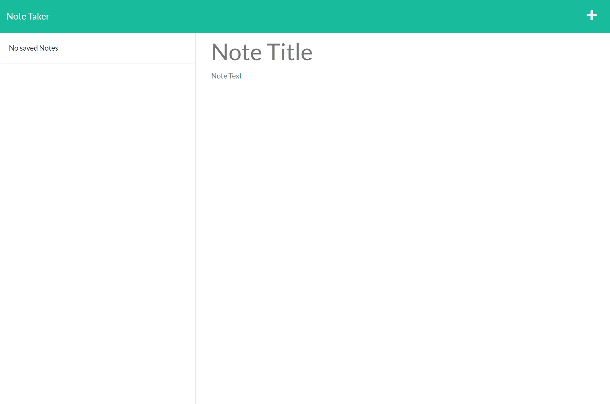

# Note_Taker

## Description

An application that allows the user to make notes to remind them of things. Notes are stored in a list. Notes can be added and deleted by the user.  
App repository can be found [here](https://github.com/Swagnarok630/Note_Taker).

## Table of Contents

* [Criteria](#criteria)
* [Installation](#installation)
* [Usage](#usage)
* [Contributing](#contributing)
* [Tests](#tests)
* [Questions](#questions)
* [Notes](#notes)
* [License](#license)

## Criteria

* Application should have a launch page
* User will be taken to notes page when selecting to start
   * Notes page will have a list
      * List appears if user has previously entered notes
   * Notes page allows for new note to be added
   * Notes can be deleted
   * Notes from the list can be selected and viewed
   * Buttons for saving new note or creating new note

## Installation Instructions

No installation needed. The user may use the app as it is deployed [here](https://note-taker-s630.herokuapp.com/)

## Usage

User may use the app once they are on the notes page, and begin entering in notes and saving them.

## Contributing

Anyone is welcome to contribute to this project as they see fit, as there can be many more improvements made. Look for my contacts in the upcoming Questions section.

## Tests

No test cases needed.

## Questions

If there are any questions or concerns regarding the app, you may contact me through the following:
* Github - <https://github.com/Swagnarok630>
* E-mail - swagnarok.630@gmail.com

## Notes

### Future Features
* Possibly add the ability to update/edit current notes in the list
* Possibly add a search function in the case the list is very large
* Would love to add a theme switcher for a Light/Dark mode

## License

Copyright (c) Darryl Le. All rights reserved.  
Licensed under [MIT](https://opensource.org/licenses/MIT) license(s).
